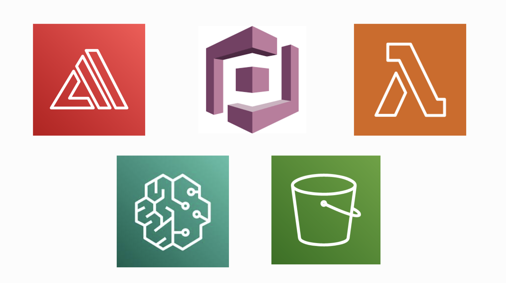

# Projecto AWS - CHATBOT LCC

Plataforma web con un chatbot inteligente que responde preguntas sobre información institucional específicamente sobre la *Licenciatura en Ciencias de la Computación* de la *Universidad de Sonora* usando **IA generativa** y **RAG**, desplegada en **AWS** con **API Gateway**, **SageMaker** y **Amplify**, e integrada con Cognito para autenticación.

### Página web 
Diseñar tu interfaz gráfica, con las herramientas de tu elección pero que AWS Amplify soporte. Una vez creada tu carpeta, subirla a AWS Amplify , donde wste servicio te permite crear y publicar aplicaciones web o móviles de manera rápida sin tener que configurar un servidor.  Al igual que agregar un firewall básico con el servicio de Amplify.

Pasos generales:
- Diseñar la UI (estructura, botones, chatbot, estilos).
- Crear una carpeta que contenga el sitio (index.html, CSS, JS).
- Subir el proyecto a AWS Amplify → Hosting, seleccionando Deploy without Git (ZIP upload).

Amplify se encarga de:

- - Desplegar y hostear la página.
- - Proveer una URL pública.
- - Agregar un firewall básico integrado para tráfico malicioso (protección mínima).

### Backend  
Para procesar preguntas y comunicarse con SageMaker, se crea una función en AWS Lambda:
Nombre: RAG_Backend
Runtime: Python 3.12
Con dependencias nativas de AWS (boto3) para invocar un endpoint de SageMaker.

La Lambda:

- Recibe la pregunta.
- Realiza comprobaciones de CORS.
- Envía el texto al modelo desplegado en SageMaker.
- Devuelve la respuesta generada.
Esta función actúa como backend principal del chatbot.

### Lambda + API Gateaway
Conectar la función Lambda con una **API Gateway**. Por lo que primero se tiene que acceder a API Gateway y dar click en Create API, después: 
- Elegir HTTP API (más simple)
- Crear nueva integrada a Lambda:
- Integration type: Lambda
- Lambda: RAG_Backend
- Crear ruta
- Method: POST
- Path: /chat
- Habilitar CORS
- Allow Origins: *
- Allow Methods: OPTIONS,POST
- **Deploy API**.
*Copiar la URL resultante*

### Conectar HTML con API Gateway
En un *script* dentro del htmml donde va el chatbot. Con esto la web se comunica directamente con Lambda mediante la API.

### Creación de Endpoint de SageMaker 
Para crear un endpoint es necesario entrar a SageMaker → Inference → Endpoints, después seguir las siguientes instrucciones:
- Elegir modelo Hugging Face (o el que usaste)
- Crear endpoint (tarda unos minutos)
- Copiar el ENDPOINT_NAME
- Pégalo en tu Lambda
- ENDPOINT_NAME = 'nombre-del-endpoint'

### Documentos del RAG
Para almacenar los documentos estáticos, es necesariocrear un *bucket* en **S3** , seguido de subir los documentos como Reglamentos, Datos de titulación, PDFs,etc.
Al igual que la creación de un script que lee los documentos y extrae solo el texto(omite objetos de estilo y de más)

 ### Seguridad 
 **AWS Cognito** es un servicio que proporciona autenticación, autorización y gestión de usuarios para aplicaciones web y móviles.
 Para poder gestionar tu aplicación utilizando este servico, se tiene que seguir los siguentes pasos:
- Creat un User Pool
- Crear APP Client
- Seleccionar criterios (email,nombre,apellido, numero telefonico,etc.) dependiendo del usuario que se quiera crear

Siguiendo estos pasos, se puede lograr un chatbot sencillo con gestión de usuario.

link: https://staging.d3503m3mxp9bxi.amplifyapp.com/?code=a541d8ac-7f6f-4834-b389-f38c61889363 
