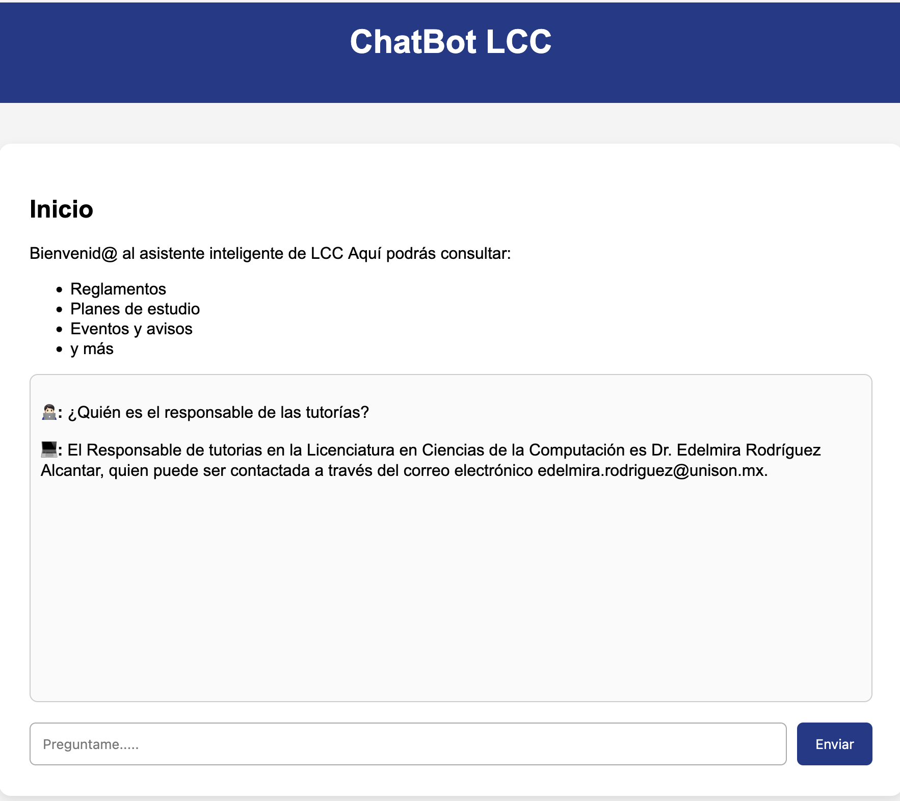
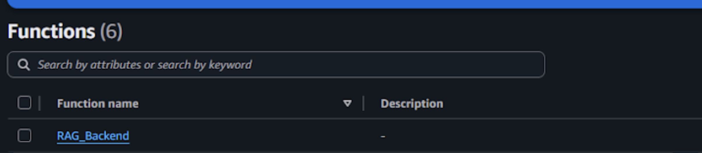
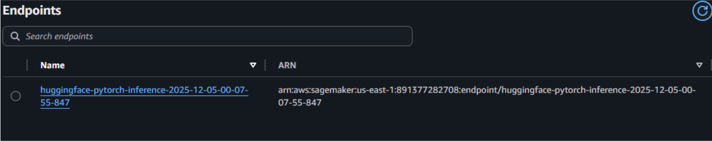
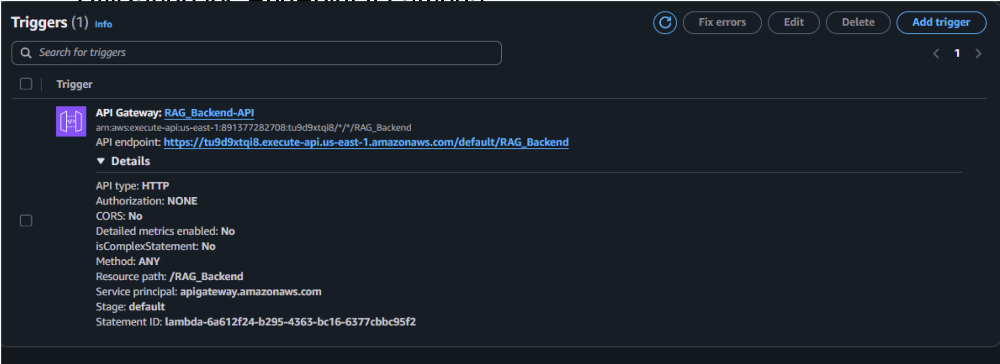
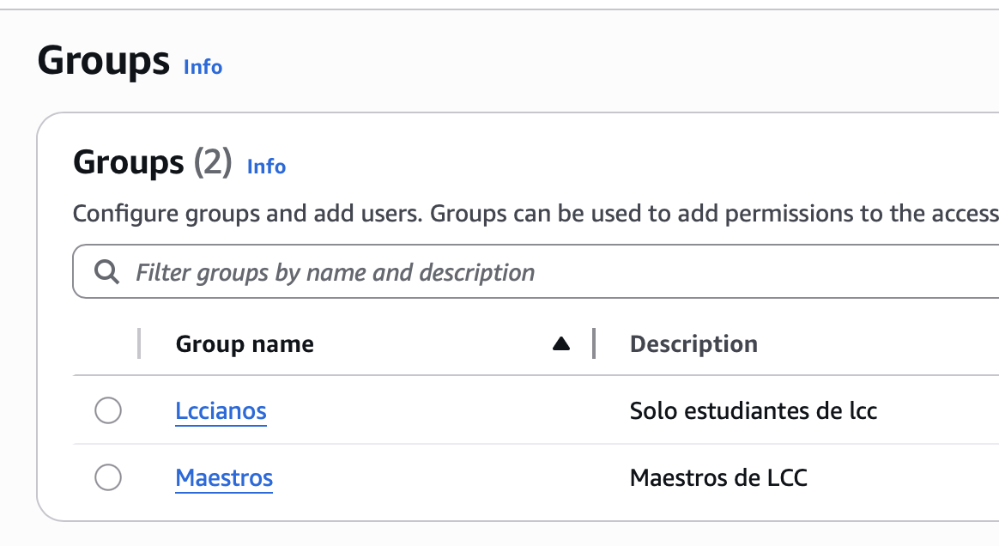

# ChatBot LCC con AWS

Este proyecto consiste en el desarrollo de un asistente inteligente para la Licenciatura en Ciencias de la Computación (LCC) de la Universidad de Sonora, utilizando servicios administrados de AWS.

El objetivo principal es crear un chatbot capaz de responder preguntas sobre reglamentos, planes de estudio, eventos, avisos y documentos oficiales, todo mediante un sistema RAG (Retrieval-Augmented Generation) conectado a un modelo de lenguaje desplegado en Amazon SageMaker.
La solución incluye una interfaz web estática desplegada en AWS Amplify, una API en API Gateway, un backend serverless en AWS Lambda, un motor LLM en SageMaker.

Esta propuesta surgue de la necesidad de poder consultar información importante, oficial y segura. El proyecto está orientado a apoyar a estudiantes y profesores de la LCC para que puedan consultar informaión especifica de la Licenciatura de manera más sencilla y rápida.  Al igual que hay información especifica dificil de encontrar, lo cual puede causar una perdida de tiempo y que no la encuentres al final.

Se utilizaron diversos servicios de AWS, Amplify,Cognito,, S3,Lambda y SageMaker

### Funcionalidades del sistema

1. Chatbot Inteligente con un Interfaz web simple y amigable.
Permite hacer preguntas en lenguaje natural, conectado a un modelo de lenguaje en SageMaker
2. Una arquitectura RAG, la cual recupera los documentos desde S3 y procesa los diferentes archivos para poder así generar una buena respuesta basandose en datos reales.
3. Backend Serverless, Lambda recibe la pregunta del usuario → Se conecta al endpoint de SageMaker →Manejo de CORS para permitir uso desde Amplify → Respuesta JSON al frontend

5. API Gateway,Exposición segura del backend

6. Hosting con AWS Amplify Página web estática con HTML/CSS/JS, implementación por ZIP upload e integración directa con API Gateway
7. Seguridad, se insertaron roles y un firewall básico proporcionado por aws amplifiy y la gestion de usuarios utilizando Cognito.

